<h1 align="center">👉 Studio Vision Project 👈</h1>
This project is designed to streamline studio management by providing comprehensive tools for studio owners and employees. It includes systems for managing accounts, authentication, inventory, orders, and employee tracking, ensuring efficient and organized studio operations.

## 🚀 Technologies Used

#### 🌐 Front-end
-  &nbsp;   &nbsp;   &nbsp; 

#### 🖥️ Back-en
-   &nbsp; 

#### 🗄️ Database
-   &nbsp; 

#### 🛠️ Tools & Environment
-   &nbsp;   &nbsp;   &nbsp;   &nbsp; 

#### 🔧 Other Technologies
-   &nbsp;   &nbsp;   &nbsp; 

#### 🤖 Miscellaneous
- 

## Project Overview

### Accounts and Authentication System 🔒
- Comprehensive user account management and authentication system.
- Role-based permissions to control user access based on job titles and specific permissions

### Employee Dashboard 📊
- Real-time status tracking (online/offline, active/inactive) of employees.
- Detailed employee profiles with action tracking, salary history, job title changes, login/logout records.
- Full editing capabilities for employee data, including the ability to add deductions.

### Inventory System 📦
- Clean, efficient inventory management to track products and set limits to prevent overstocking.
- Automated alerts for low stock, with deactivation of out-of-stock products to prevent sale.
  
### Cashier Interface 💰
- Customer management: create new customers, update existing data, and search via customer code or phone number.
- Order management: unique order ID generation, structured order storage (year/month/day/order_id).
- Payment processing: calculate total price, apply discounts, manage payments (total, paid, remaining).
- Order history: open order folders, generate and print order bills.

### Editor Interface 📝
- Order list with advanced filtering options to identify relevant orders quickly.
- Comment system for collaborative communication between editors.

## 🌐 The Web Apps of the Project
1. Accounts
2. Cashier
3. Editor
4. inventory
5. Dashboard
6. Settings

## 🤝 Contributing 
1. Fork the repository.
2. Create a new branch.
3. Make your changes.
4. Submit a pull request.

  

### 🌐 Explore the Live Project
Check out the live project [here](http://51.20.117.160:8000) to see it in action! 🚀
- username: admin
- password: mans123

## 📸 Screenshots

### Login: 🔑
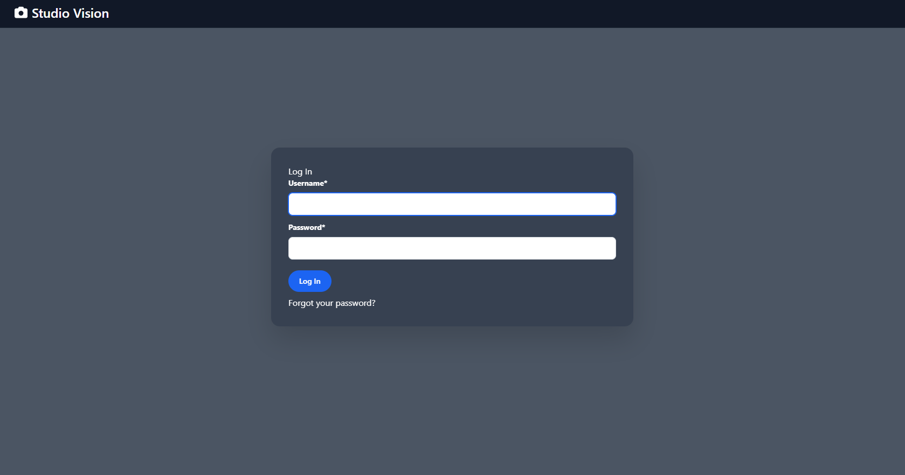

### Home: 🏠
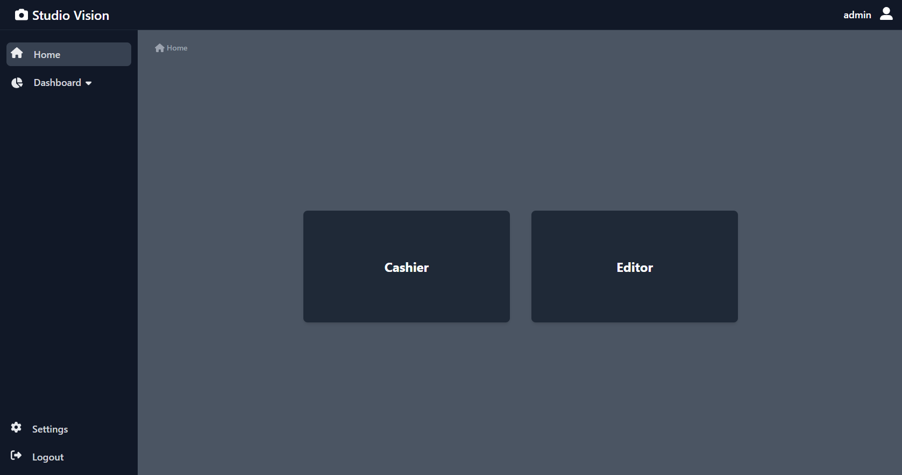

### Cashier: 💰
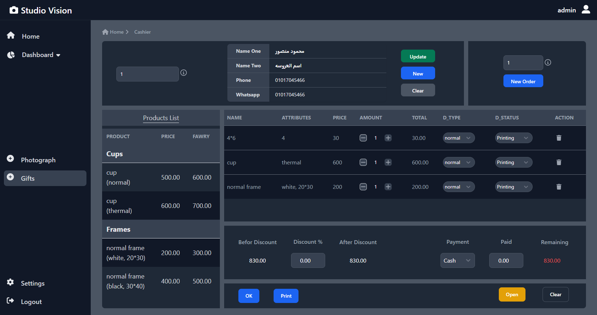
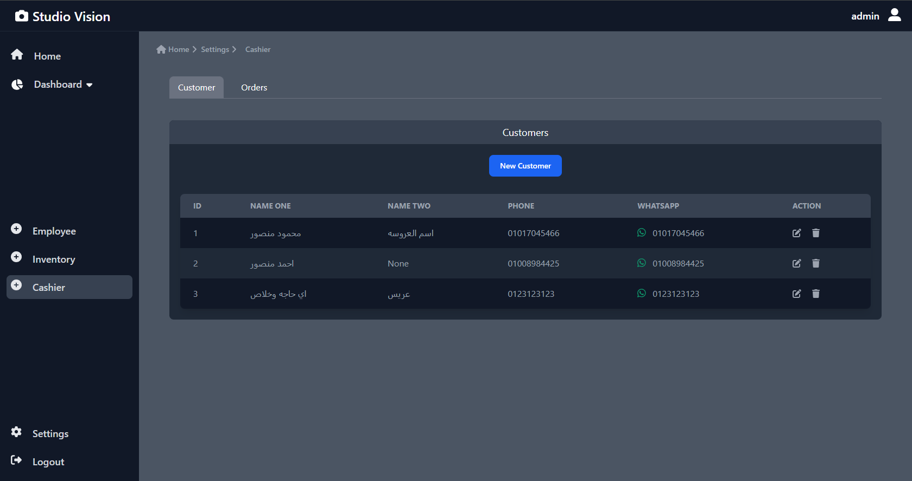
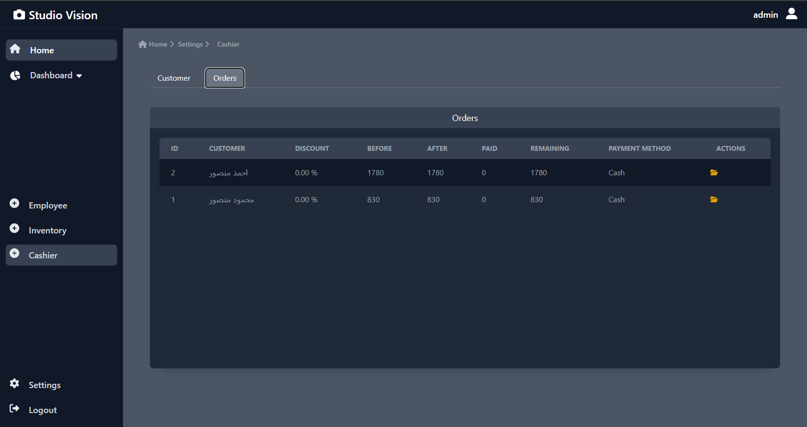

### Editor: ✏️
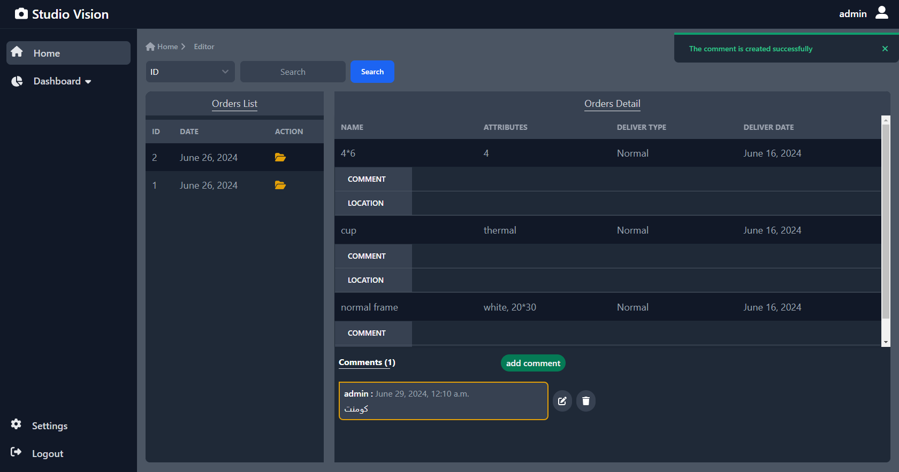

### Inventory: 📦
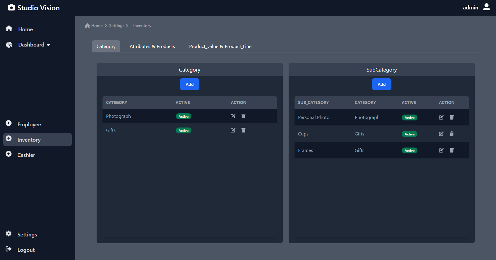
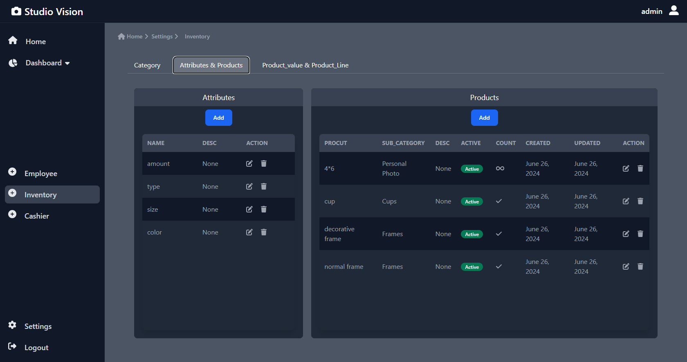
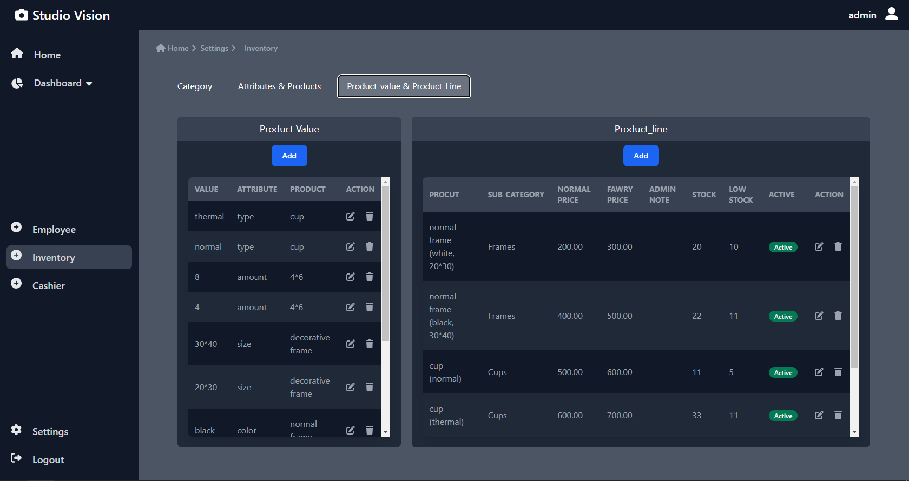
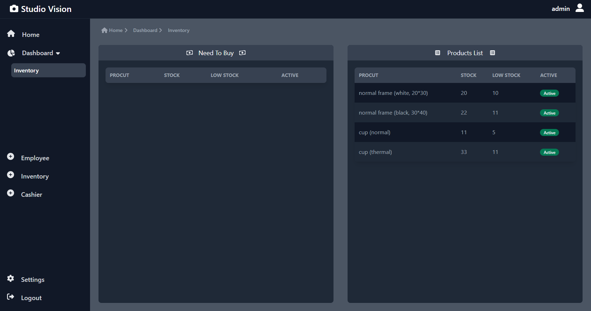

### Employee: 👤
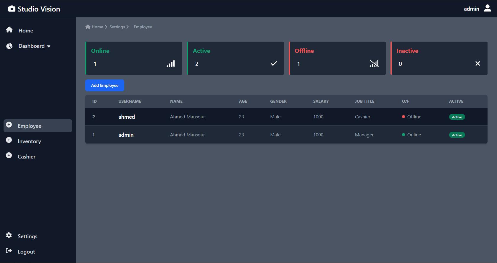
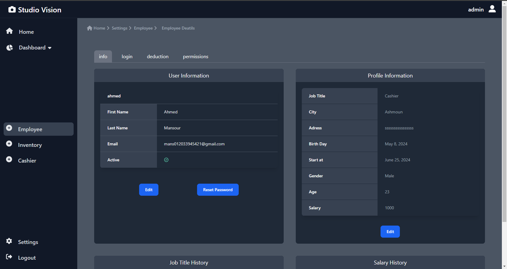
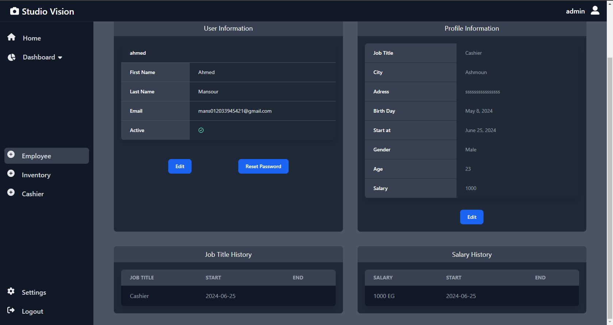
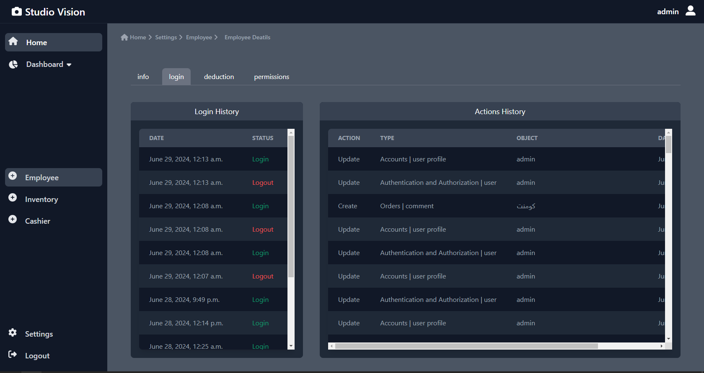
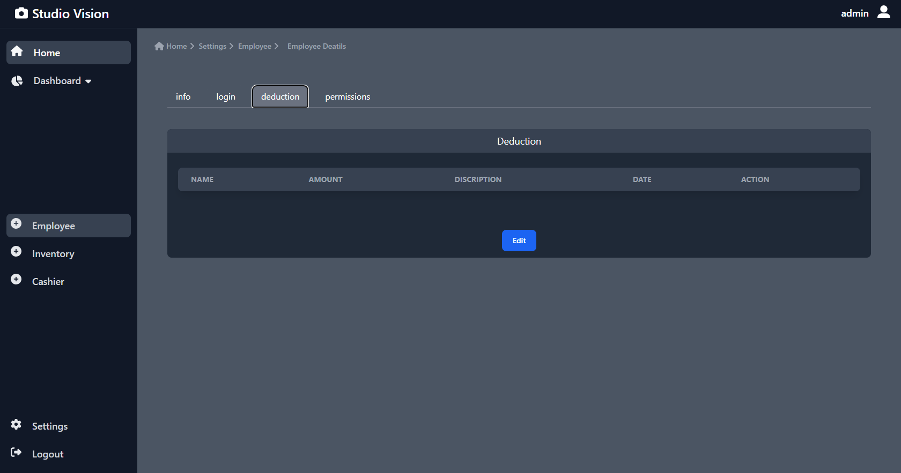
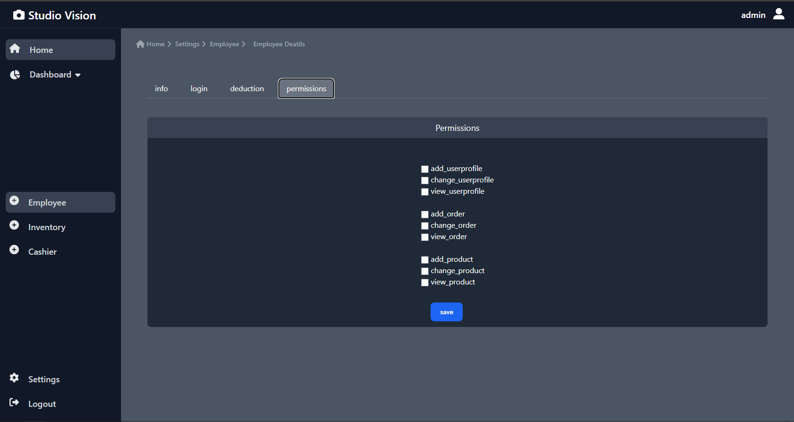
